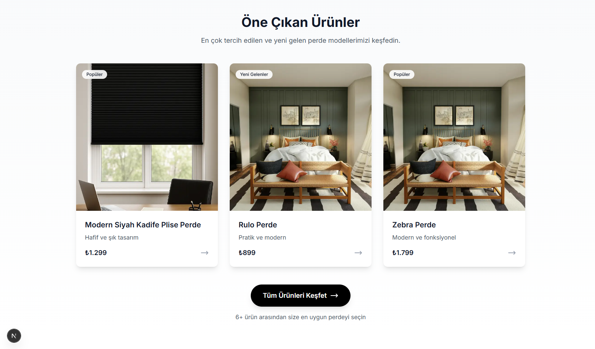
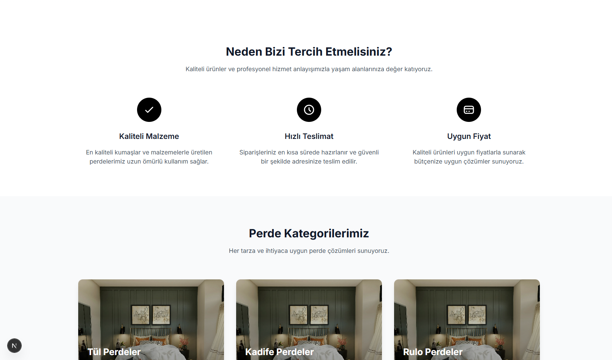
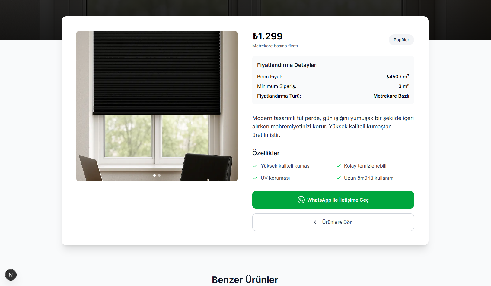
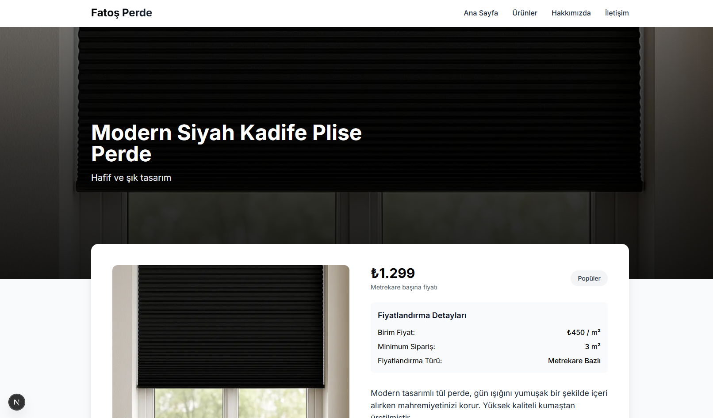

# 🛍️ Ürün Tanıtım Sitesi

Bu proje, ürünlerin tanıtıldığı ve filtreleme özelliği bulunan basit ama işlevsel bir web sitesidir. Kullanıcılar ürünleri filtreleyebilir ve detay sayfasında ürün hakkında bilgi alabilir.

---

## 🖼️ Ekran Görüntüleri

Ana Sayfa  




Ürünler Sayfası


Ürün Detay Sayfası  




---

## 🚀 Özellikler

- ✔️ Ürün listeleme
- ✔️ Kategoriye göre filtreleme
- ✔️ Ürün detay sayfası
- ✔️ Responsive tasarım (mobil uyumlu)
- ✔️ Temiz ve sade kullanıcı arayüzü

---

## 🛠️ Kurulum ve Çalıştırma

### 1. Bağımlılıkları Yükleyin:

```bash
npm install
# veya
yarn install
```
### 2. Build Al (Üretim İçin Derleme):

```bash
npm run build
# veya
yarn build
```

### 3. Uygulamayı Üretimde Başlat:

```bash
npm start
# veya
yarn start
```
